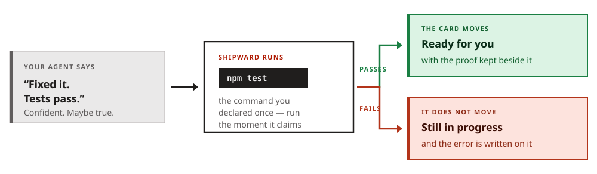
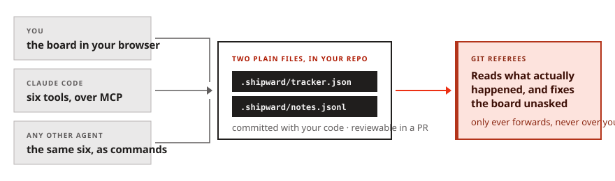

# Shipward

### A project board for people who work with AI coding agents — that checks the agent's work instead of taking its word for it.

You use Shipward like any kanban board: cards for what needs doing, columns for
where each one is. Your AI agent uses the very same board as its memory — it reads it when a
session starts, and writes to it as it works.

The difference is what happens when the agent says a task is finished.

---

## The one thing to understand

Every other board takes the agent at its word. When your agent says *"Done — tests pass,"* the
card moves. Shipward runs your project's test command first, and **only moves the card if it
actually passes.**



You set this up once, in one line, per project. After that nobody has to remember to check —
not you, not the agent.

---

## What you get

**A board in your browser** at `localhost:4747`. Four columns — what's queued, what the agent
is working on right now, what's waiting for you, and what has shipped. You drag cards; the
agent moves them too, and you watch it happen live.

**A record you can actually read.** As the agent works it writes down what it decided, what
broke, and what surprised it. Next session it reads that back instead of starting from
nothing — and so can you.

**One page for all your projects.** If you have ten repos, you get one screen showing what's
in flight anywhere, what's been waiting on you longest, and which projects have gone quiet.

**Nothing to sign up for.** It's two files inside your own repo, committed alongside your
code. No account, no server, no database, nothing sent anywhere.



---

## Why it's better than the alternatives

There are other task trackers built for AI agents. Here is the honest difference.

|  | Shipward | Everything else |
|---|---|---|
| **What marks a task done** | a command you chose, actually passing | the agent saying it's done |
| **When the board is wrong** | git corrects it automatically, before you look | it stays wrong until you notice |
| **Old notes that are no longer true** | flagged — it tells you how much has changed since | presented as if still current |
| **Where your history lives** | in your repo, in your pull requests | a hidden database, or outside your project |
| **Across all your projects** | one page for every board you own | one project at a time |

### The four advantages, plainly

**1 — It doesn't believe the agent.** This is the whole point, and nothing else does it. A
command either passed or it didn't, and that's what moves a card. You can override, but the
override gets written down, so it can't quietly become the norm.

**2 — Its memory tells you when it's gone stale.** Notes rot. *"All tests pass"* was true on
Tuesday and means nothing today. Shipward records **which version of your code** each note was
true of, and later tells you how far things have moved since. Every other tool hands you old
notes as though they were current.

**3 — Git settles arguments.** Your board says one thing, your repo says another. Shipward
reads what actually happened and quietly fixes the board before your next session — but only
ever forwards. It will never undo a decision you made, because no commit can record what you
intended.

**4 — It shows you what's unresolved.** A dedicated view for the awkward questions: a card
claiming it shipped when it never did, a branch nobody owns, work sitting untouched for a week,
tasks closed without ever being checked. It only reports. You decide.

---

## Try it in a minute

```bash
git clone https://github.com/albertoclemente/shipward
node shipward/setup.mjs ~/code/your-project    # wires it up, touches nothing else
node shipward/serve.mjs                        # open localhost:4747
```

Then tell it what "working" means for that project — one line, once:

```jsonc
"checks": { "default": ["npm", "test"] }
```

That's it. Nothing gets marked done without passing it.

Works with Claude Code out of the box, and with any other agent that can run a command.

---

## Being straight with you

A tool that argues against overconfidence shouldn't be overconfident about itself.

- **It proves a command passed. It doesn't prove your work is right.** Those are different
  things, and Shipward always says which one it means.
- **A check is only as good as the command you pick.** A flaky test will block good work.
- **Until you set a check, it proves nothing** — cards move on the agent's word, like everywhere
  else.
- **It can't express "this is blocked by that."** No dependency graphs. If you need those at
  scale, [Beads](https://github.com/gastownhall/beads) is genuinely better and worth your time.
- **One person, one machine.** No accounts, no permissions, no team features. The board runs
  unauthenticated on your own computer — right for a laptop, wrong for a shared server. It will
  not let anything reaching that port install a command for it to run, but everything else on
  the board is editable by whoever can reach it.
- **It watches; it doesn't drive.** No diff viewer, no agent supervision.

---

## It was built using itself

Every feature here was used to build the next one, and the board in this repo is the real one —
every card and every note written while making it, including the mistakes.

A locking bug that silently lost work. A safety check whose error handling turned a crash into
total silence, so a broken session looked fine. A test that passed against a file the tracker
itself had just modified — caught by the very feature that had shipped hours earlier, which
promptly caught its own author.

Those notes ship with the code. They're the most honest documentation here.

---

## Requirements

Node 20 or newer, macOS or Linux. No dependencies, no build step, no account.

## Licence

MIT — see [LICENSE](LICENSE).
