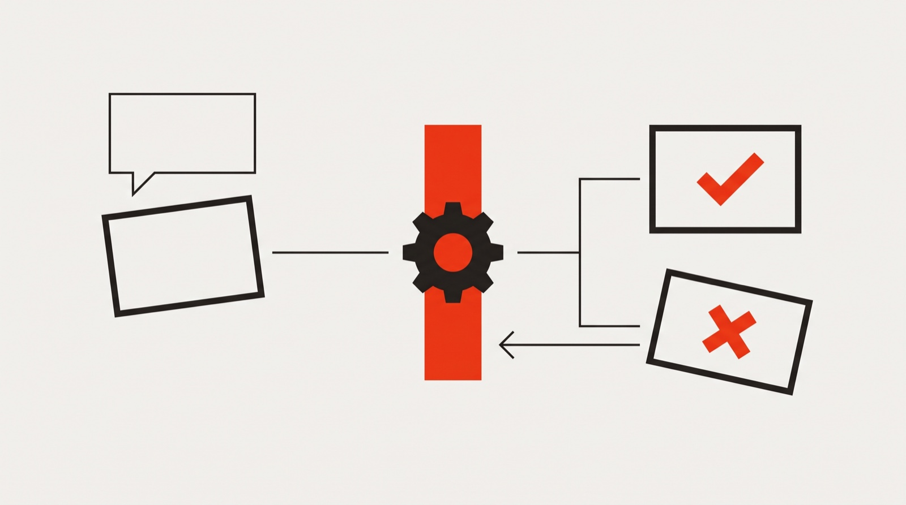

# Shipward

### The project board that doesn't take your coding agent's word for it.

**For one developer working with an AI coding agent.** Runs on your machine, lives in your
repo, no account.


---

## You've had this evening

Your agent says **"Done — tests pass."** The card moves. You close the laptop.

Two days later you open the project and something doesn't add up. A card says shipped, but
the commit isn't there. A note says *"all tests pass"* — true on Tuesday, meaningless now,
still sitting there looking current. You spend the first hour of your session working out
which parts of your own board you can still believe.

Nothing lied to you. The board just wrote down what it was told.

---

## Why this keeps happening

Every task tracker built for AI agents has the same shape:

> **The agent does the work, and the agent writes its own report card.**

The board is a filing cabinet. It files the claim exactly as given. Nothing in the middle
ever asks *is that actually true?*

So the only thing checking is you, reading the diff. **You are the verification step.**
That's the real reason you can't walk away while it works.

---

## The fix, in one sentence

> ### The agent doesn't get to grade its own work.

When your agent says a task is finished, Shipward runs your project's test command **first**,
and only moves the card if it actually passes.



You set that command once, per project, in one line. After that nobody has to remember to
check — not you, not the agent.

---

## Your agent runs the board itself

You are not the go-between. Shipward hands your agent six commands of its own — **read the
board, search the memory, file a card, take a card, hand it back, reconcile with git** — and
it uses them on its own, without being told to.

It opens a session by reading the board. It files a card the moment it notices a bug it
wasn't looking for. It takes a card, works, and hands it back through the gate. It writes
down what it decided and what surprised it, then searches those notes weeks later.

You don't maintain this board for your agent. You watch your agent keep it.

---

## And it becomes the project's memory

None of that disappears when the session does.

The board is two files inside your own repo, committed next to your code. So it outlives the
end of a session, a context window that filled up, a machine you swapped, an agent you
replaced. Three days later your agent opens the same project and reads its own record back:
what it decided, what it tried, what bit it — **and which of those notes have stopped being
true since.**

That is the difference between a to-do list and a memory. A to-do list tells your agent what
to do next. This tells it everything it already learned about your project, and how much of
it still holds.

You read the same record it does.

---

## The same idea, in four places

Once the agent stops being the source of truth about its own work, one question has to be
answered for every fact on the board: **who has the authority to say this?**

**1 · Did the command pass? → The machine says so, not the agent.**
And the command is one *you* wrote, in your project's config. Not free text on a card the
agent can edit. **The agent cannot write the exam it sits.** That separation is the actual
product; running the test is only how it's enforced.

**2 · Did the work land? → Git says so, not the board.**
Shipward reads your repo and corrects the board before your next session, without being
asked. Only ever forwards: it fills blanks and confirms what shipped, and it will never undo
a call you made — because no commit can record what you intended.

**3 · Is this note still true? → The changes since say so, not the note.**
Every note records which version of your code it was true of, and later tells you how far
things have moved. Everywhere else, a note from three weeks ago looks exactly like one from
this morning.

**4 · Do two things contradict? → The board says so, before you ask.**
One view for the awkward questions: a card claiming it shipped when it didn't, a branch
nobody owns, work untouched for a week, tasks closed without ever being checked. It reports.
You decide.

Keeping your board in git is **storage** — several tools do that. Letting git *overrule* your
board is **arbitration**. That's the difference.

|  | Shipward | Everything else |
|---|---|---|
| **What moves a card to done** | a command you chose, actually passing | the agent saying it's done |
| **When the board is wrong** | git corrects it before you look | it stays wrong until you notice |
| **Notes that stopped being true** | flagged, with how much has changed since | shown as if still current |
| **Contradictions in your project** | listed on a page, unprompted | you find them the hard way |

---

## What that buys you

**You can leave it running longer.** The gate holds whether or not you're watching. Coming
back to *done* means a command passed — not that the agent believed it had. Not
unsupervised. **Checked.**

**Your first hour back isn't archaeology.** You stop re-explaining the project, and your agent
stops starting from nothing.

**A memory that ages honestly.** Old notes are marked old. That is rarer than it sounds.

**One page for every project.** Ten repos, one screen: what's in flight anywhere, what's been
waiting on you longest, which projects have gone quiet.

---

## Try it in a minute

```bash
git clone https://github.com/albertoclemente/shipward
node shipward/setup.mjs ~/code/your-project --seed-from-branches
node shipward/serve.mjs                        # open localhost:4747
```

`--seed-from-branches` means **your board isn't empty on day one.** It files one card per
branch that has unmerged work, using what git already knows — the branch name, its commits.
Nothing is invented, and merged branches are left alone. Leave the flag off and setup just
shows you what it *would* file.

Then tell it what "working" means for that project — one line, once:

```jsonc
"checks": { "default": ["npm", "test"] }
```

That's it. Nothing gets marked done without passing it.

Open a session and the first thing your agent sees is a standup — with the board already
corrected wherever git could prove it wrong.

Your board is two files inside your own repo, committed next to your code. No account, no
database, nothing sent anywhere. Works with Claude Code out of the box, and with any agent
that can run a command.

---

## Being straight with you

A tool that argues against overconfidence shouldn't be overconfident about itself.

- **It proves a command passed. It doesn't prove your work is right.** Different things, and
  Shipward always says which one it means. An agent that writes a passing test for broken
  code defeats this completely.
- **A check is only as good as the command you pick.** A flaky test will block good work.
- **Until you set a check, it proves nothing** — cards move on the agent's word, like
  everywhere else.
- **It can't express "this is blocked by that."** No dependency graphs, no ready-work queue.
  If you're coordinating several agents across hundreds of issues, this isn't that tool.
- **One person, one machine.** No accounts, no permissions, no team features. The board runs
  unauthenticated on your own computer — right for a laptop, wrong for a shared server. It
  will not let anything reaching that port install a command for it to run, but everything
  else on the board is editable by whoever can reach it.
- **It watches; it doesn't drive.** No diff viewer, no agent supervision.

---

## It was built using itself

Every feature here was used to build the next one. The board in this repo is the real one —
66 cards and 222 notes written while making it, including the mistakes.

A locking bug that silently lost work. A safety check whose error handling turned a crash
into total silence, so a broken session looked fine. A test that passed against a file the
tracker itself had just modified — caught by the very feature that had shipped hours earlier,
which promptly caught its own author.

Those notes ship with the code. They're the most honest documentation here.

---

## Going deeper

[**How it works**](docs/how-it-works.md) — the same product at the level of the code: the
three tiers git reconciles in, what a check may and may not be, how evidence is anchored and
expired, and the incident behind each rule.

[**CLAUDE.md**](CLAUDE.md) — the protocol your agent actually follows.

## Requirements

Node 20 or newer, macOS or Linux. No dependencies, no build step, no account.

## Licence

MIT — see [LICENSE](LICENSE).
