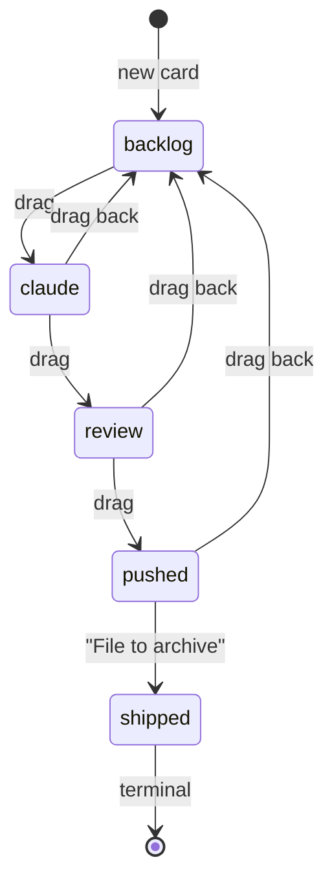

# Interaction rules

Behaviour that decides what gets written. Layout and styling live in the adopted `design_handoff_shipward/README.md`; this file is the state machine and the copy.

## Status transitions

Any column-to-column drag is permitted; the diagram shows the intended flow, not a restriction. Rules applied on arrival:

| target | effect |
|---|---|
| `claude` | set `claude: "queued"`; if `branch` is empty, auto-name it `feat/`\|`fix/`\|`chore/` + kebab-cased first 3 words of the title, matching the card's `type` |
| `review` | keep `branch` |
| `pushed` | keep `branch`; set `pushed` to now. Leave `commit` null — Claude Code owns it |
| `shipped` | reached only via the "File to archive" ghost button on a `pushed` card; set `shipped` to now. The card leaves the board for the Archive tab |
| `backlog` | clear `claude` back to null |

**Clearing `claude` on the way out.** Leaving `claude` for anywhere other than backlog settles the field to `"done"`; leaving for backlog nulls it. Only applies when `claude` was `queued` or `working` — an already-`done` or null field is left alone. A drag onto the column a card already occupies is a no-op: no write, no feed entry.

Every transition persists immediately and appends one feed entry.

## Feed copy — verbatim

These are user-visible strings, not templates to paraphrase. `{id}` is the card id.

| trigger | message |
|---|---|
| card created | `You added {id} to Backlog — it's on the list` |
| → `claude` | `{id} handed to Claude Code — queued` |
| → `review` | `{id} moved to Review — give it a look` |
| → `pushed` | `{id} pushed to production — nice work` |
| → `shipped` | `{id} filed to the archive` |
| → `backlog` (sent back) | `{id} sent back to Backlog` |
| deleted | `{id} deleted — one less thing` |

The "sent back" line is absent from the README's copy list but present in the prototype's `moveMsg`; the prototype is the only source for it.

UI-originated entries are `by: "user"`; Claude Code writes `by: "claude"`.

## Relative time

Used by the activity strip and card rows.

| age | rendering |
|---|---|
| < 90s | `just now` |
| < 1h | `Nm ago` |
| < 24h | `Nh ago` |
| otherwise | `Mon D` (e.g. `Jul 14`) |

## Drag & drop

HTML5 drag and drop. The column under the pointer takes an `accent-100` background while a card hovers over it; dropping moves the card and applies the table above. Cards show `cursor: grab`.

## Live reload

The UI polls `GET /api/tracker` every ~3s. When the returned document differs from the rendered one, re-render the board, archive and activity strip, surfacing the newest feed line. This replaces the prototype's simulated Claude pickup — in production the movement comes from Claude Code, through the MCP server or by editing the file on disk.

Polling is sequential, not interval-driven: a `GET` slower than the interval would otherwise overlap the next one and let an older document land after a newer one. A poll in flight when a write starts is discarded rather than applied.

## Ephemeral UI state

Not persisted to `tracker.json`; lives only in memory:

`{view: board|archive, editing: cardId|'new'|null, dragOver: colKey|null, etag, offline: bool, error: string|null}`

`etag` is the precondition for the next `PUT`; `offline` (the server is gone) and `error` (the server said no) are deliberately separate, because rendering them the same made a rejected write look like a lost one.
